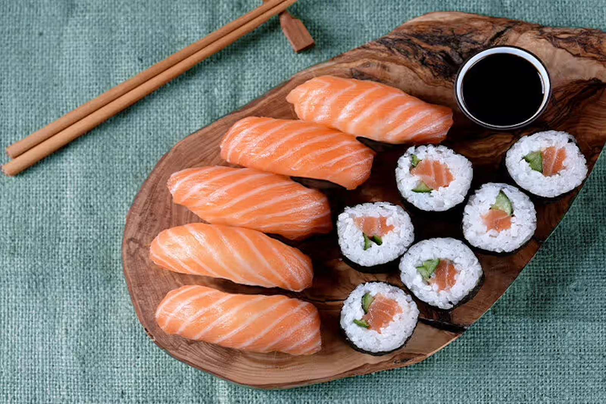
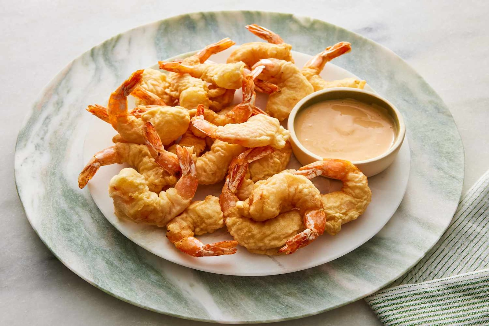
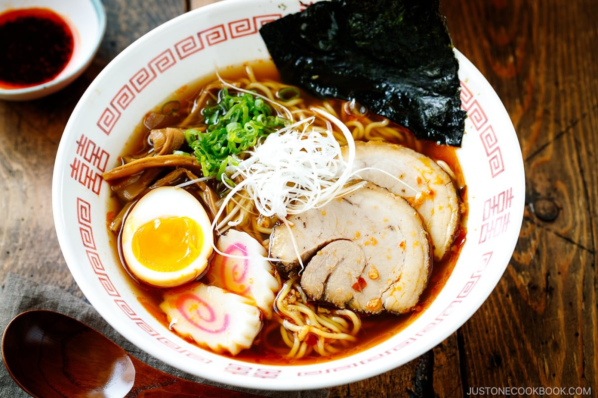
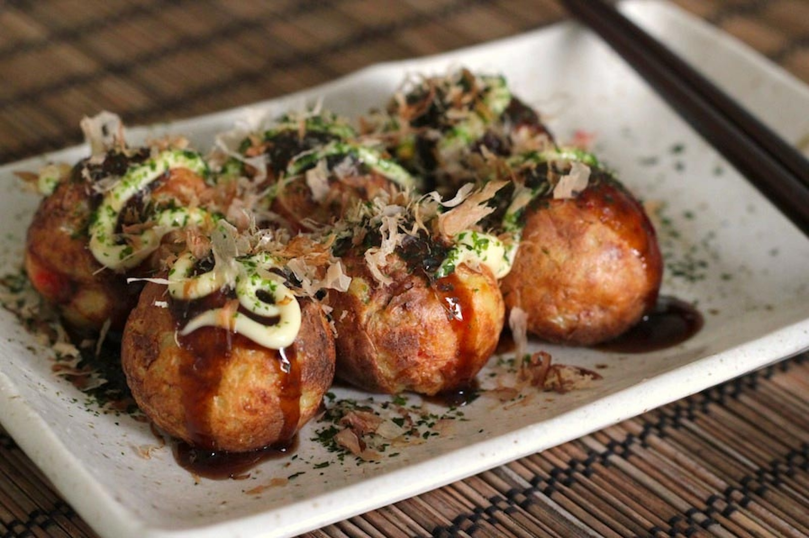
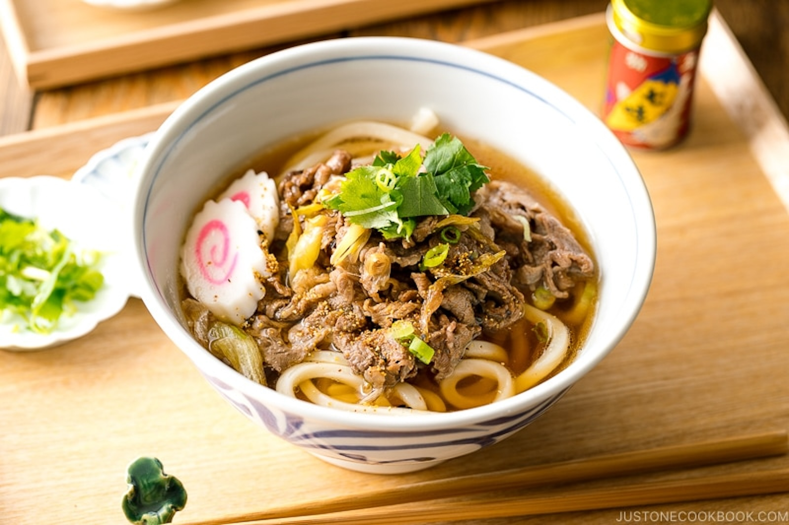
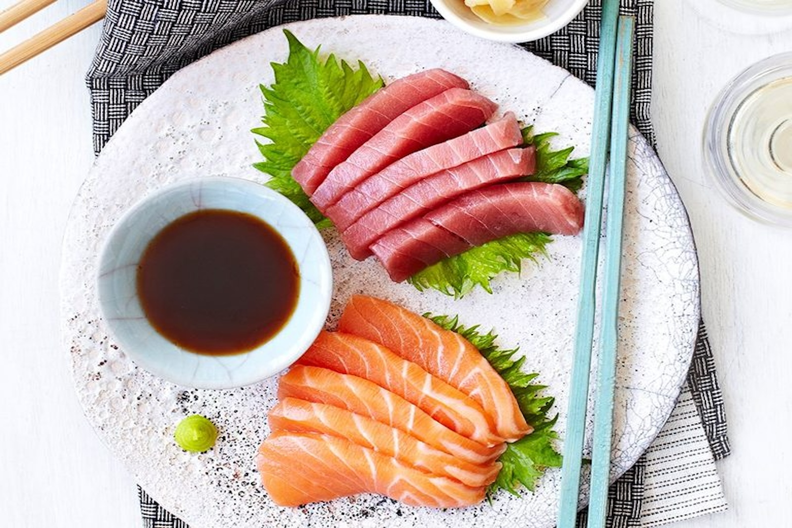
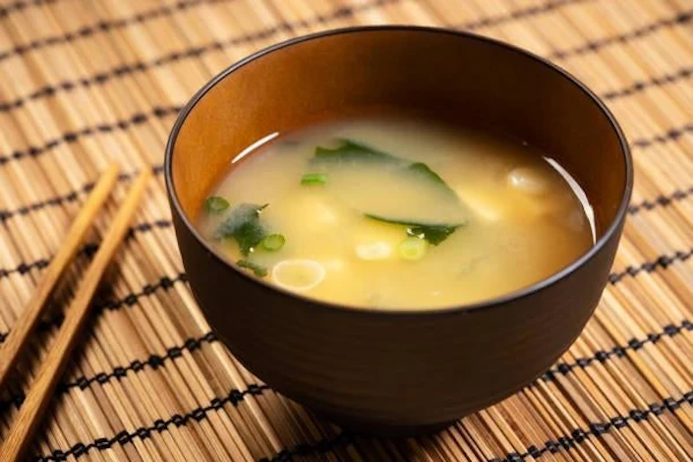
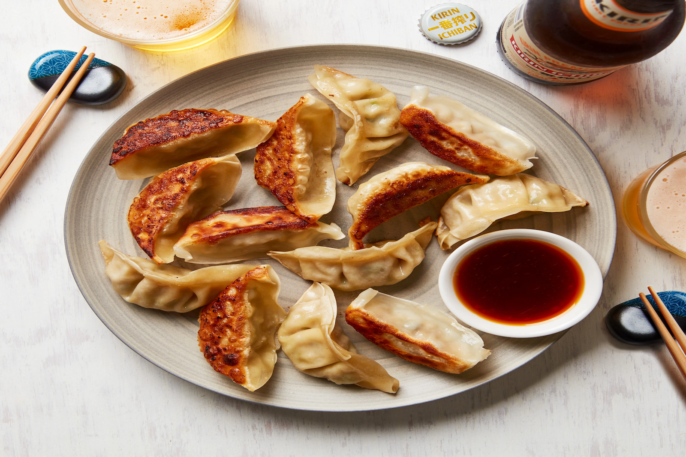
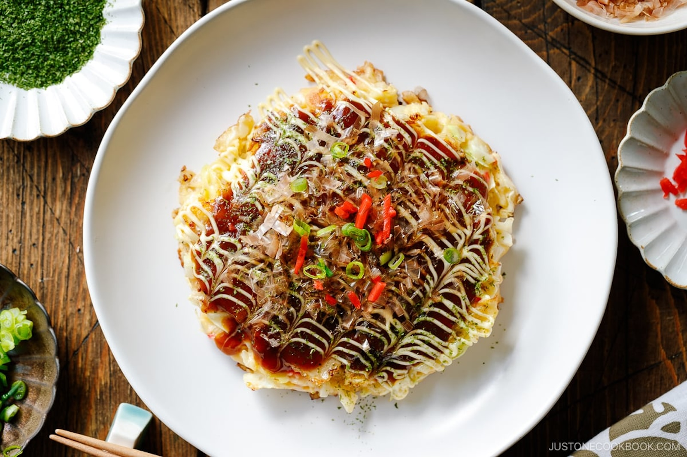

## Menu

[Japanese](#japanese) | ...

## Japanese

| Menu             | Description                                                                                                                                                                                                                         | Figure                                                      | Price |
|:-----------------|-------------------------------------------------------------------------------------------------------------------------------------------------------------------------------------------------------------------------------------|-------------------------------------------------------------|-------|
| Sushi            | A popular Japanese dish consisting of vinegared rice paired with a variety of ingredients such as raw fish, seafood, and vegetables, often served with soy sauce, wasabi, and pickled ginger.                                       |              | 370฿  |
| Tempura          | A light and crispy dish made by deep-frying seafood, meat, and vegetables that have been coated in a special tempura batter. It's typically served with a dipping sauce made of soy sauce, mirin, and dashi.                        |          | 300฿  |
| Ramen            | A comforting and hearty noodle soup featuring Chinese-style wheat noodles served in a meat or fish-based broth, often flavored with soy sauce or miso, and topped with sliced pork, nori, green onions, and a soft-boiled egg.      |              | 270฿  |
| Takoyaki         | Small, round snacks made of a wheat flour-based batter and filled with minced or diced octopus, tempura scraps, pickled ginger, and green onion, topped with takoyaki sauce, mayonnaise, and bonito flakes.                         |        | 170฿  |
| Udon             | Thick and chewy wheat noodles served in a hot broth, often accompanied by tempura, vegetables, or a variety of proteins. The broth is typically made from dashi, soy sauce, and mirin, creating a savory and umami-rich experience. |                | 200฿  |
| Sashimi          | A delicacy consisting of thinly sliced raw fish or seafood, often served on a bed of shredded daikon radish. Unlike sushi, sashimi is not accompanied by rice, allowing the natural flavors of the fish to shine.                   |          | 500฿  |
| Miso Soup        | A traditional Japanese soup made from a stock called dashi, mixed with softened miso paste. Common ingredients include tofu, seaweed, and green onions, offering a light and savory start to any meal.                              |           | 120฿  |
| Gyoza            | Japanese pan-fried dumplings filled with ground meat, vegetables, and seasonings. The dumplings are first fried to give them a crispy bottom, then steamed to ensure the filling is juicy and flavorful.                            |              | 160฿  |
| Okonomiyaki      | A savory Japanese pancake made with a batter of flour, eggs, shredded cabbage, and a variety of ingredients such as pork, seafood, or cheese. It's typically topped with okonomiyaki sauce, mayonnaise, bonito flakes, and seaweed. |  | 300฿  |
| Matcha Ice Cream | A rich and creamy dessert made from high-quality matcha (green tea) powder, which gives the ice cream a vibrant green color and a distinctive, slightly bitter yet sweet flavor that is both refreshing and indulgent.              |            | 150฿  |