## Menu

[Thai Food](#thai-food) | [Indian Food](#indian-food) | [Italian Food](#italian-food-section) | [Beverages](#beverages)...

## Thai Food

=======
|  Spicy shrimp soup(Tom yum goong)    | Tom yum goong is a spicy, sour soup with shrimp, mushrooms, lemongrass, and lime. Best with rice. ||    149฿     |
|  Spicy green papaya salad(Som tum)   | Som tum is a spicy green papaya salad from Isaan, Thailand, with garlic, chilies, and beans. It can also include peanuts, shrimp, or crab. | |    79฿    |
|  Chicken in coconut soup(Tom kha kai)| Tom kha kai is a creamy chicken soup with coconut milk, galangal, lemongrass, and chillies. It’s topped with lime leaves and served with rice. | |    109฿     |
|  Red curry(Gaeng daeng)              | Gaeng daeng is a mild red curry with meat and coconut milk, topped with kaffir lime leaves. It can be spiced up or made vegan with tofu. | |    99฿    |
|  Thai-style fried noodles(Pad Thai)  | Pad Thai is a Thai stir-fried noodle dish with beansprouts, egg, and seafood or meat, flavored with fish sauce, shrimp, and chili. It’s served with lime and peanuts. | |    115฿    |
|  Stir-fried basil and pork(Pad krapow moo) | Pad krapow moo is a Thai dish with minced pork, basil, chili, green beans, soy sauce, and sugar, stir-fried and served over rice with a fried egg on top. | | 135฿ |
|  Green chicken curry(Gaeng keow wan kai)   | Gaeng keow wan kai is a green chicken curry with coconut milk and herbs. It’s sweeter than tom yum and pairs with rice or flatbread. | | 129฿ |
|  Sour Curry with Mixed Vegetables(Gang Som Pak Ruam) | The Thai fusion of sweet, sour and spicy are all combined into another ultra vibrant soup. | | 129฿ |
|  Thai massaman curry(Gang Massaman) | Massaman is a sweet curry that originates from Southern Thailand as a Halal dish. | | 159฿ |
|  Stir Fried Chicken with Curry Powder(Gai Pad Pongali) | Chicken, onions, tomatoes and peppers are brought alive with a delicate Thai yellow curry paste. | | 109฿ |

## Indian Food

|          Menu               |           Description            | Figure |Price  |
|:----------------------------|----------------------------------|--------|------:|
|Samosas    | Samosas are fried or baked pastry pockets with a savory filling such as spiced potatoes, onions and peas.  |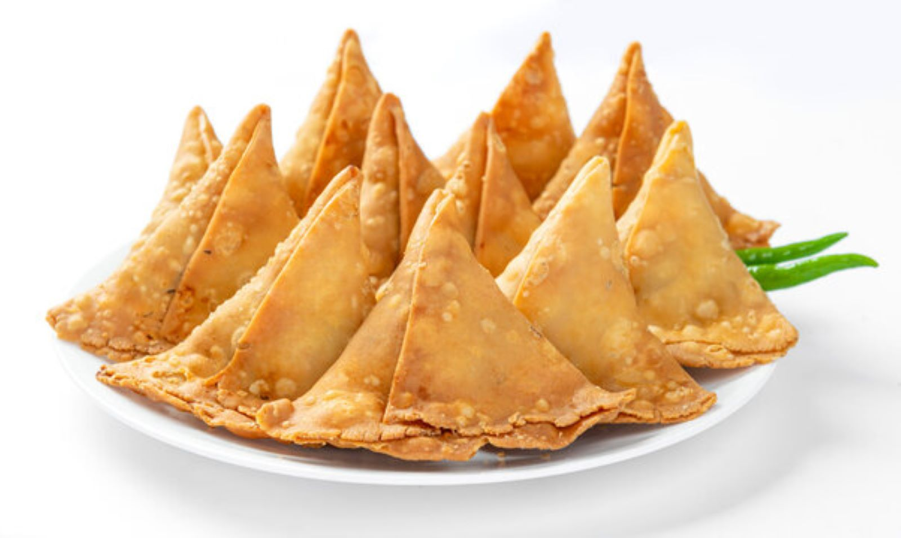|    80฿     |
|Matar Kulcha |This simple snack consists of a soft flatbread served with spiced white pea gravy and is one of the most famous street foods in Delhi. |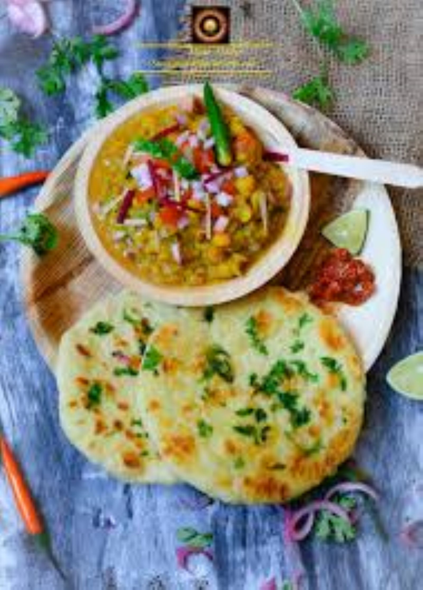| 100฿|
|Kathi Rolls |Modern kathi rolls refer to practically any wrap with a filling folded in an Indian flatbread and containing ingredients such as eggs, chicken, mutton, chutney or chilies.  |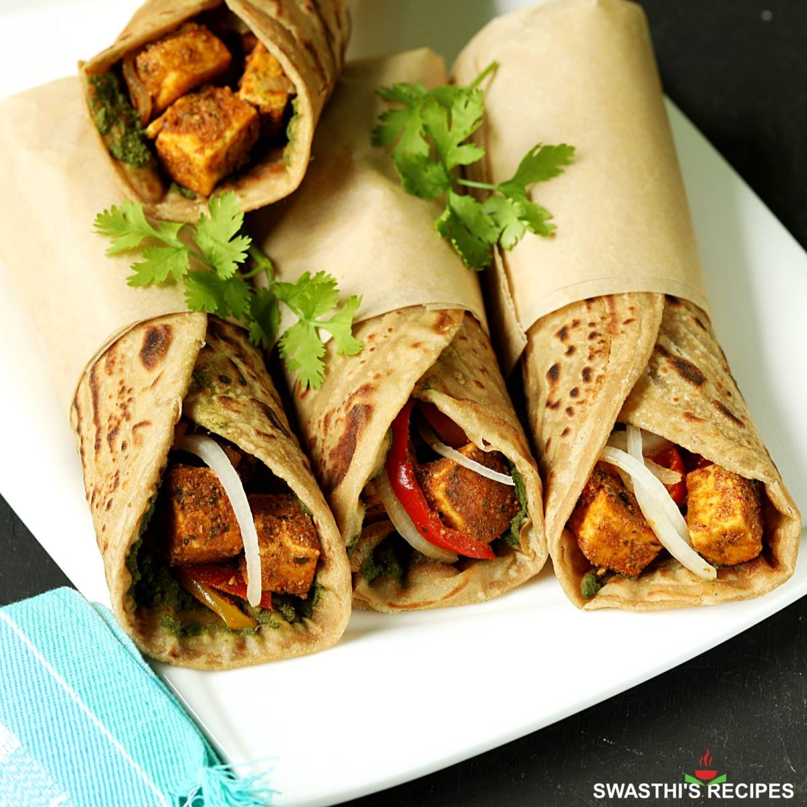| 100฿|
|Sambar |The South Indian lentil-based vegetable stew, sambar, is often cooked with pigeon peas and tamarind broth. The dish is often enjoyed with rice, dosa or idli, a type of savory rice cake made by steaming a fermented batter of rice and lentils.|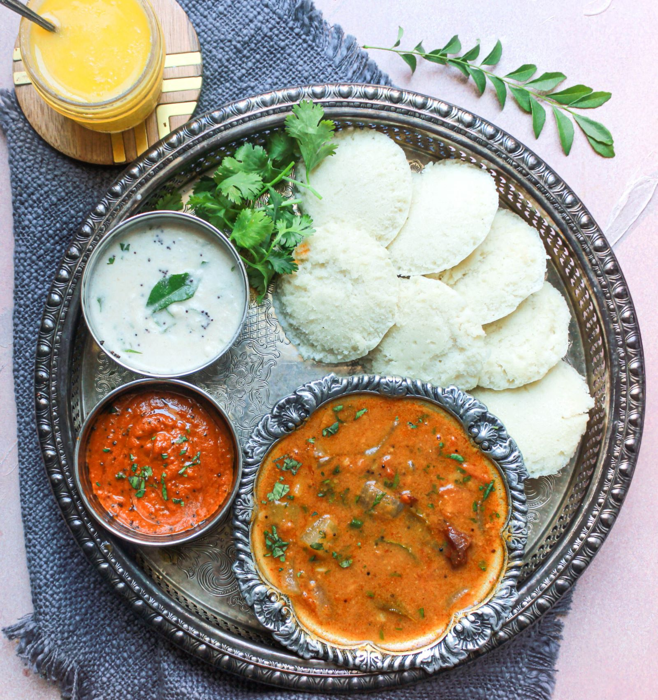|60฿|

## Italian Food

| Menu       | Description                 |              Figure          | Price  |
|:-----------|:----------------------------|------------------------|-------:|
| Fettucine Alfredo   | A fettucine pasta in creamy parmesan cheese sauce. Flavor will take you to Rome. |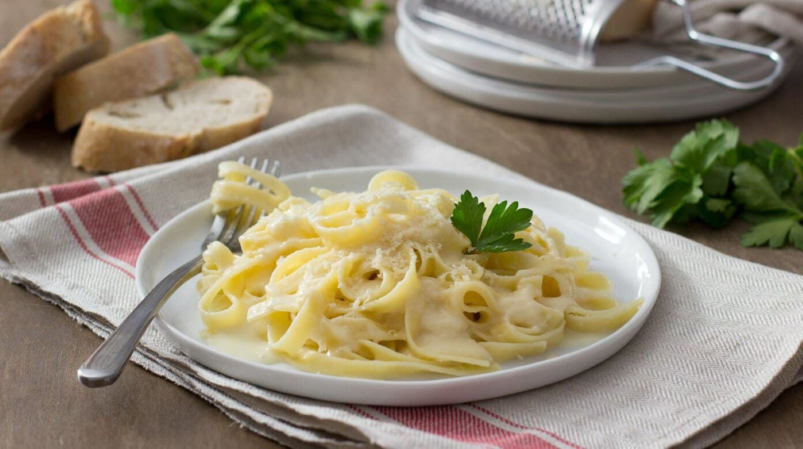 | 189฿ |        |
| Lasagna   | Meat sauce, cheese, and lasagna noodle. A layer of flavor, over and over. |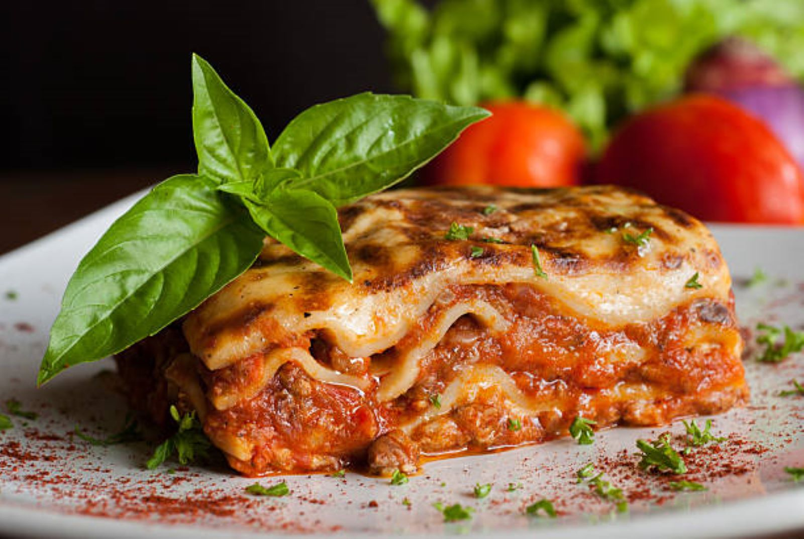 | 239฿ |        |
| Pizza   | Italain classic, and of course, no pineapple! |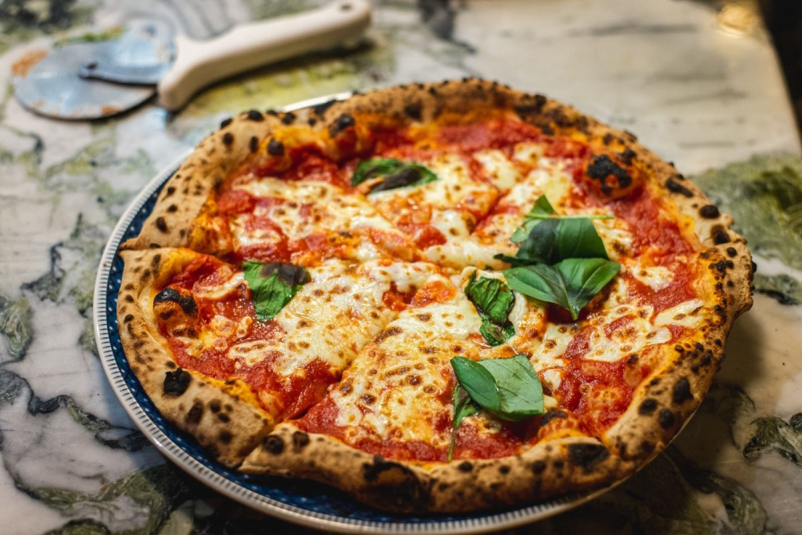 | 259฿ |        |
| Ravioli   | A pasta wrap aroud meat filling shape in rectangular style with an iconic edge cut. |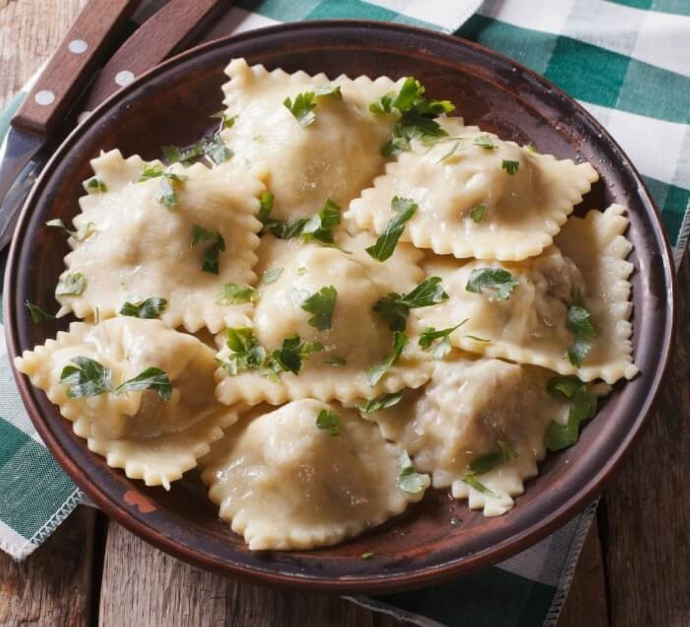 | 189฿ |        |
| Risotto   | Rice menu from Italy, pack with a cheesy flavor. |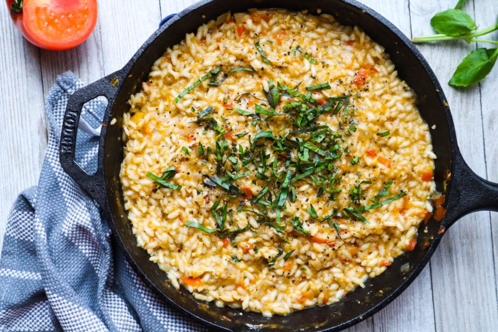 | 159฿ |        |
| Tiramisu   | A combination of desert and coffee to end your beautiful meal. |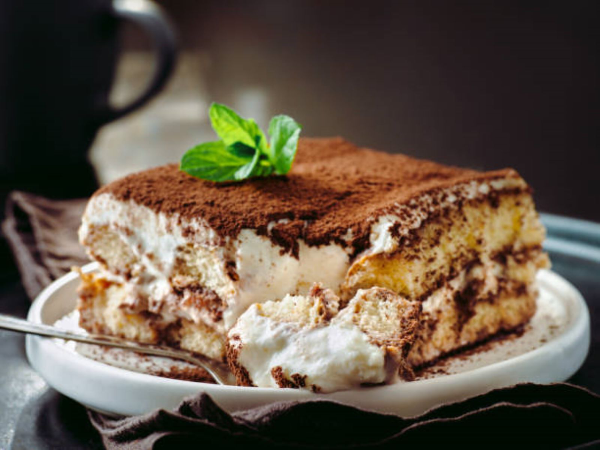 | 139฿ |        |

## Beverages
|          Menu               |           Description            | Figure |Price  |
|:----------------------------|----------------------------------|--------|------:|
|Espresso             |Rich aroma that kick through your nose. Perfect start for your day!| 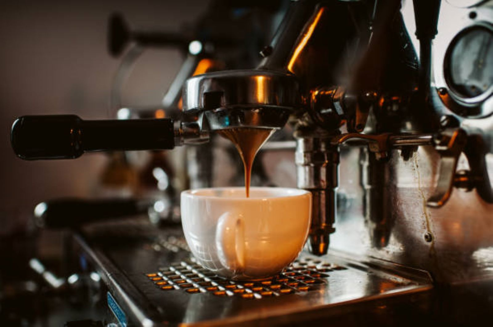 | 45฿ |
|Iced Thai Tea                |Sweet and creamy Thai tea with a blend of spices, served chilled. | 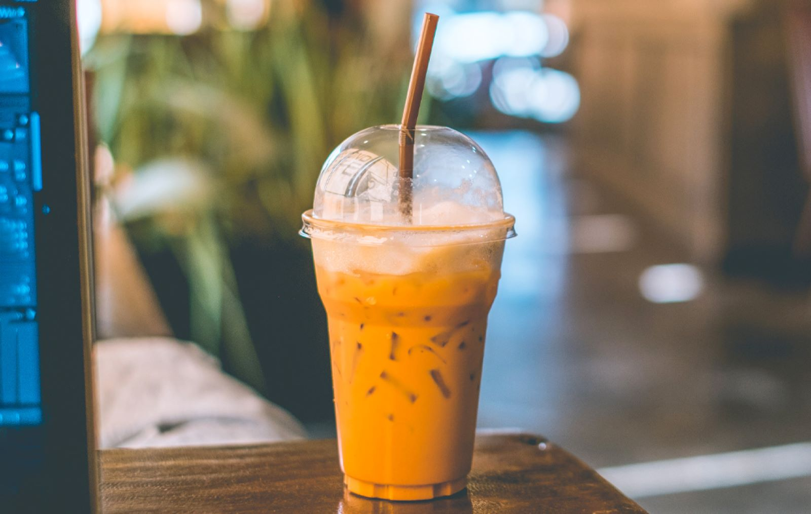 | 45฿ |
|Pepsi Cola|Classic carbonated soft-drink.|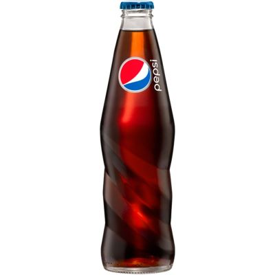| 20฿|
