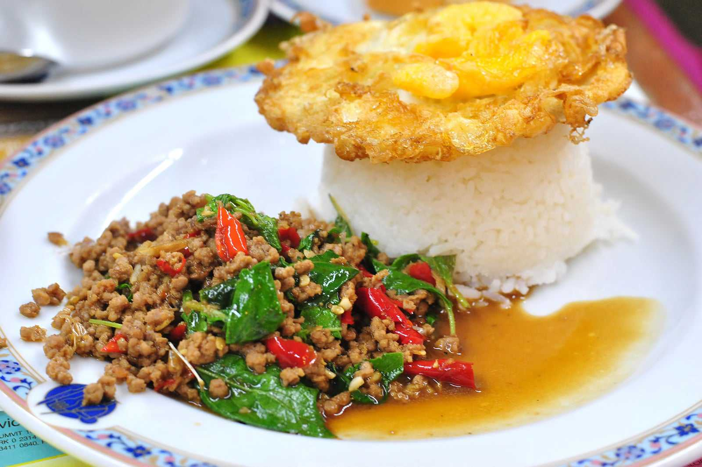

## Menu

[Thai Food](#thai-food) | 

## Thai Food
|          Menu               |           Description            | Figure |Price  |
|:----------------------------|----------------------------------|--------|------:|
|  Spicy shrimp soup(Tom yum goong)    | Tom yum goong is a spicy, sour soup with shrimp, mushrooms, lemongrass, and lime. Best with rice. ||    149฿     |
|  Spicy green papaya salad(Som tum)   | Som tum is a spicy green papaya salad from Isaan, Thailand, with garlic, chilies, and beans. It can also include peanuts, shrimp, or crab. | |    79฿    |
|  Chicken in coconut soup(Tom kha kai)| Tom kha kai is a creamy chicken soup with coconut milk, galangal, lemongrass, and chillies. It’s topped with lime leaves and served with rice. | |    109฿     |
|  Red curry(Gaeng daeng)              | Gaeng daeng is a mild red curry with meat and coconut milk, topped with kaffir lime leaves. It can be spiced up or made vegan with tofu. | |    99฿    |
|  Thai-style fried noodles(Pad Thai)  | Pad Thai is a Thai stir-fried noodle dish with beansprouts, egg, and seafood or meat, flavored with fish sauce, shrimp, and chili. It’s served with lime and peanuts. | |    115฿    |
|  Stir-fried basil and pork(Pad krapow moo) | Pad krapow moo is a Thai dish with minced pork, basil, chili, green beans, soy sauce, and sugar, stir-fried and served over rice with a fried egg on top. | | 135฿ |
|  Green chicken curry(Gaeng keow wan kai)   | Gaeng keow wan kai is a green chicken curry with coconut milk and herbs. It’s sweeter than tom yum and pairs with rice or flatbread. | | 129฿ |
|  Sour Curry with Mixed Vegetables(Gang Som Pak Ruam) | The Thai fusion of sweet, sour and spicy are all combined into another ultra vibrant soup. | | 129฿ |
|  Thai massaman curry(Gang Massaman) | Massaman is a sweet curry that originates from Southern Thailand as a Halal dish. | | 159฿ |
|  Stir Fried Chicken with Curry Powder(Gai Pad Pongali) | Chicken, onions, tomatoes and peppers are brought alive with a delicate Thai yellow curry paste. | | 109฿ |